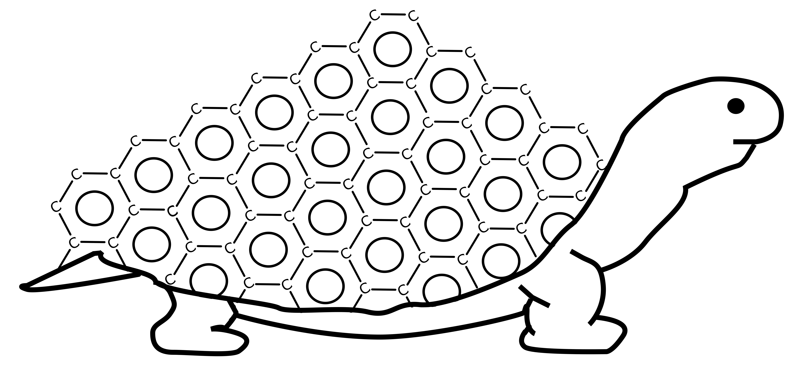

.. T.U.R.T.L.E. documentation master file, created by
   sphinx-quickstart on Mon Oct 16 13:06:21 2023.
   You can adapt this file completely to your liking, but it should at least
   contain the root `toctree` directive.

Welcome to T.U.R.T.L.E.'s documentation!
========================================

Design, create, and generate unique, complex molecular structures of any shape and size!

.. image:: https://github.com/Dfilono/Molecule-Builder/actions/workflows/python-package.yml/badge.svg
   :target: https://github.com/Dfilono/Molecule-Builder/actions/workflows/python-package.yml
   :alt: GitHub actions build status

.. image:: https://codecov.io/gh/Dfilono/Molecule-Builder/branch/main/graph/badge.svg
   :target: https://codecov.io/gh/Dfilono/Molecule-Builder
   :alt: Codecov test coverage

.. image:: https://img.shields.io/github/license/Dfilono/Molecule-Builder
   :target: https://github.com/Dfilono/Molecule-Builder/blob/main/LICENSE

.. image:: https://img.shields.io/github/repo-size/Dfilono/Molecule-Builder
   :target: https://github.com/Dfilono/Molecule-Builder

.. image:: https://img.shields.io/badge/code%20style-black-000000.svg
   :target: https://github.com/psf/black

.. image:: https://img.shields.io/badge/linting-pylint-yellowgreen
    :target: https://github.com/PyCQA/pylint

Motivation
==========

The Toolkit for Universial Reconstruction of Theoreticl Lattice Environments (TURTLE) goal is to ease the process of
generating unique and complex molecular structures for computational chemistry. Available as a standalone python-package,
or as a plugin for `Avogadro2 <https://www.openchemistry.org/projects/avogadro2/>`__, TURTLE aims to quickly generate
the intial state of molecular strcutres that are ready for optimization via quamtum or classical calculations!

Generating intial structure files for calculations can be a tedious process, one that TURTLE aims to fix. 
Large structures can be generated quickly, and are very tunable based on the need of the user! 
Currently only basic shapes such as boxes and spheres are generatable, but more complex meshes are in the works!

Approach
========

TURTLE takes an input molecules (or molecules) and copies them into a grid filling out a user defined volume.
The number of molecules in the volume can be specially defined, calculated via a desired density, or for filling space.
The orientation of the molecules can be randomized so structures are closer to their equilibrium point, but will still need outside optimization.
Molecules can also be placed randomly instead of in a grid, allowing for a more disordered structure.

Features
========

- Generate a box or sphere of molecules
- Generate a box or sphere of molecules around an existing molecular structure
- Fill a volume, or place a specfied number of molecules in space
- Randomly orient molecules to better represent an equilibrium structure
- Read/Write structures from XYZ and PDB formats

Installation
============

You can install the latest development version of TURTLE from the `Github Repository <https://github.com/Dfilono/Molecule-Builder>`__

.. code-block:: bash

      git clone https://github.com/Dfilono/Molecule-Builder
      cd Molecule-Builder
      pip install .

A PyPI version is in progress!

Citation
========

If you find this code helpful, please consider referencing it! We don't currently have a released article to cite,
but any reference to our work helps acknowledge the effort put into developing and maintaining this code base, 
provides support for further development!

License
=======

Distributed under the MIT License. See `LICENSE <https://github.com/Dfilono/Molecule-Builder/blob/main/LICENSE>`__ for more information.

.. toctree::
   :hidden:

   Input <input>
   Generate a Box <box>
   Generate a Sphere <sphere>
   Density <rho>
   Outpute <out>

